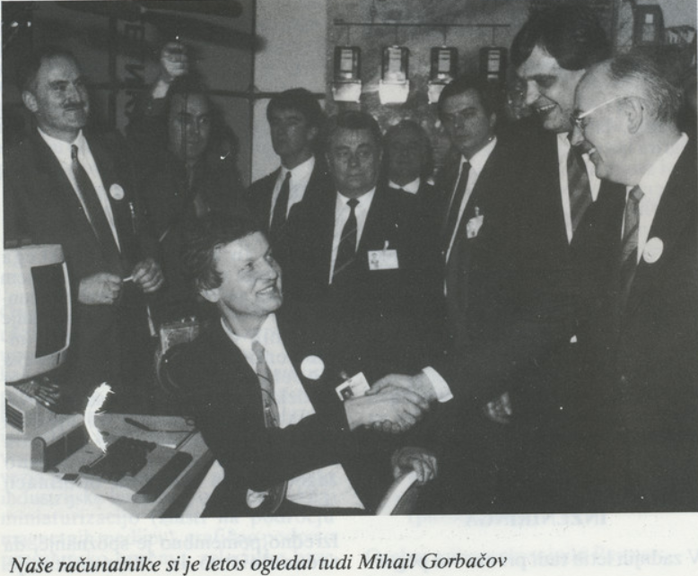

# Zahod levo, Vzhod desno in Iskra Delta vmes

Iskra Delta je svoje največje uspehe uživala v sredini in na koncu 80-ih let prejšnjega stoletja,
višek njenih uspehov pa se je skladal s časom visoke napetosti med ZDA in Sovjetsko zvezo,
glavnima silama Hladne vojne. Šlo je za vojno medsebojnega vojaškega in ekonomskega
izčrpavanja, do druge polovice 80-ih pa so si Združene države priborile pomembno prednost
pred Sovjeti, saj so dovolj zgodaj odkrili vrednost informacijske tehnologije. Le-ta se je
izkazala kot ključna, saj je omogočala proizvodnjo naprednejše vojaške tehnologije in
natančnejših raket, Sovjetska zveza pa je ta tehnološki zaostanek skušala nadoknaditi z večjo
kvantiteto orožij, kar je vodilo do še hujšega ekonomskega izčrpavanja, predvsem pa je
kvaliteta raket in orožja Združenih držav imela večjo težo kot kvantiteta, na katero je bila
prisiljena staviti Sovjetska zveza. Združene države Amerike so pozornost posvetile tudi
preprečevanju ali vsaj oteževanju, da bi njihova tehnologija prišla v sovjetske roke. Temu
namenu je služil embargo oziroma blokada prenosa tehnološke tehnologije in informacij iz
Zahoda na Vzhod, čemur je bila podvržena tudi Iskra Delta, saj je bila v sodelovanju z
ameriškimi proizvajalci in za potrebe proizvodnje uporabljala tudi s strani ZDA dobljene
komponente.

Sovjetska zveza je ravno v Iskra Delti videla rešitev za svoj tehnološki zaostanek za ZDA, saj
je podjetje proizvajalo tehnologijo, ki je se lahko kosala tudi z ameriško. Tako se je Iskra
Delta znašla v navzkrižnem ognju med obema poloma Hladne vojne, saj so jo pozorno
spremljale tudi ZDA, ki so v podjetju videli tržno nevšečnost (lahko bi celo rekli
konkurenčnost, a je bilo slovensko podjetje za to vendarle premajhno), predvsem pa so želeli
na vsak način preprečiti, da bi napredna tehnologija prišla v roke agentov sovjetske
obveščevalne službe KGB, saj bi to lahko pomenilo podaljšanje Hladne vojne in ponovno rast
napetosti med svetovnima silama. Že sam obstoj podjetja v tem času torej za ZDA predstavlja
preveliko tveganje.

Marca 1988 sovjetska delegacija na čelu s predsednikom Gorbačovom obišče Slovenijo, da bi
si ogledala sposobnosti Iskre in njenih podjetij, posebno Iskre Delte. Tudi njih so predstavitve
zmožnosti proizvodov Iskre Delte navdušili, zato podjetju ponudijo sodelovanje in možnost
hitre in obsežne širitve na vzhodni trg. Vodstvo podjetja sodelovanje zanima, a le v okviru
embarga in dogovora z ZDA. V začetku leta 1989 v Moskvi ustanovijo mešano
jugoslovansko-sovjetsko podjetje z imenom TEDA. Kmalu pa začne Sovjetska zveza
izsiljevati Iskro Delto in zahtevati, da se le-ta odreče zahtevi po soglasju ZDA in brez
dovoljenja administracije Združenih držav začne proizvajati svoje računalnike znotraj
Sovjetske zveze, v nasprotnem primeru bodo podjetje začeli obravnavati kot zahodno, kar bi
pomenilo izjemno otežitev pridobivanja plačil s strani vzhodnih kupcev, tudi za že dobavljeno
opremo. Ker Iskra Delta tega ne stori, začnejo sovjetski kupci spremenjene predpise
uporabljati kot izgovor, da že dobavljenih računalnikov ne plačajo v dogovorjenem roku, to
pa povzroči začetek nepremostljivih finančnih ovir za podjetje.

  

Slika 5: Fotografija predstavništva Iskre Delta in Mihail Gorbačov, ki si je prišel ogledat Deltine računalnike.
